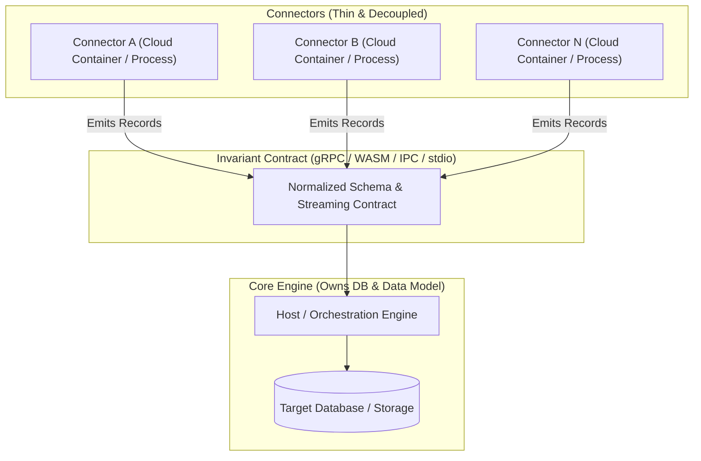

# Architecture Research: Modular Connector Ecosystem

## 1. Executive Summary & Problem Framing

### Core Requirements
* **Lineage & Metadata-First Scope:** Rather than performing high-volume bulk row ETL, connectors are dedicated to extracting **metadata, entity schemas, and cross-object lineage graphs** (e.g. database tables, views, columns, foreign keys, CRM objects, custom schemas, and object association graphs).
* **Diverse Connectors:** Many heterogeneous sources (PostgreSQL, MySQL, Snowflake, HubSpot CRM, Salesforce, Kafka).
* **Dual Deployment Target:**
  * **Desktop Mode:** Lightweight, single-process or local IPC, low resource overhead, zero complex orchestration, offline-capable.
  * **Cloud Mode:** Modular, single container per connector, independent autoscaling, isolated failure domains.
* **The "Shared Library" Paradox:**
  * Connectors need common functionality: database access, data model read/write, validation, interoperability, transformations.
  * **Critical constraint:** Preventing dependency hell and avoiding bumping/re-releasing 50+ connector packages every time the shared data layer or database schema evolves.

---

## 2. Core Architectural Observations

### The Anti-Pattern: Fat Embedded Library
If connectors statically import a library containing database clients, schema models, and business logic:
* Any database migration, driver update, or data model change requires bumping versions, rebuilding, testing, and redeploying all 50+ connectors.
* Connector code becomes coupled to storage infrastructure (SQL dialects, connection pooling, ORM versions).

### The Inversion Principle: "Smart Host, Thin Connector"
To decouple connectors from storage and data model evolutions, **connectors must not connect directly to the database**.
* The **Host/Runtime Engine** owns the database connections, migrations, storage engine, credential vaults, and central data model.
* The **Connector** is purely an adapter: it communicates with the external system, maps data into a stable protocol/schema, and emits/consumes records.



---

## 3. Retained Architectural Options (1 & 2)

| Option | Architecture | Desktop Fit | Cloud Fit | Version Decoupling | Primary Technology |
| :--- | :--- | :--- | :--- | :--- | :--- |
| **Option 1 (Selected)** | **Inverted Out-of-Process (gRPC / Sidecar Service)** | High (Host spawns binary over local socket / loopback) | Outstanding (independent container per connector) | **Maximum** (Protobuf forward/backward compatibility) | **Go** |
| **Option 2 (Alternative)** | **WASM Component Model (Extism / Wasmtime)** | Outstanding (single host process, tiny RAM) | High (WASM runtimes in containers) | **Maximum** (sandboxed guest ABI, zero container overhead) | **Rust / WASM** |

### Deep Dive: Option 1 — Inverted Out-of-Process (gRPC Sidecar / Service)
* **Design:**
  * Host and connectors are separate processes.
  * In **Cloud Mode**, each connector is packaged as a tiny, isolated container (Go static binary, ~15MB) exposing a standard gRPC service.
  * In **Desktop Mode**, the Host spawns the connector executable as a local subprocess, communicating over a local loopback port (`127.0.0.1:<port>`) or named pipes / Unix domain sockets.
* **Benefits:**
  * **True Isolation:** If a connector panics, runs out of memory, or hangs, the Host and other connectors remain unaffected.
  * **Independent Scaling:** Cloud deployment allows each connector container to scale, sleep, or autoscale based on usage.
  * **No "50x Version Bump" Overhead:** The connector only implements the invariant protocol contract (`Spec`, `Check`, `Discover`, `Read`, `Write`). The Host owns the internal storage engine, database migrations, and business data models.

### Deep Dive: Option 2 — WASM Component Model (Extism / Wasmtime)
* **Design:**
  * Connectors are compiled to portable WebAssembly (`.wasm`) modules.
  * In **Desktop Mode**, the Host loads `.wasm` files directly into its memory space via an embedded runtime (e.g. Wasmtime), eliminating multi-process management while retaining sandboxing.
  * In **Cloud Mode**, connectors can run in lightweight WASM containers or edge workers.

---

## 4. Solving the "50x Version Bump" Problem

To ensure connectors never break when the core library or data model updates:

1. **Additive Protocol Buffers / Schema Contracts:**
   * Define the connector-to-host interface via Protobuf contracts (`kraal.v1`).
   * Fields are additive and optional.
   * Connectors continue running on v1 contract while Host evolves to v2.
2. **Capability-Based Host Services (Inversion of Control):**
   * Instead of embedding internal DB drivers into connectors, the Host exposes capabilities to connectors.
   * Connectors only connect to the *external* datasource they adapt (e.g. external PostgreSQL, Salesforce, Stripe), emitting generic record envelopes.
3. **Envelope Data Model:**
   * Connectors output generic data envelopes: `Stream`, `Schema`, `Record` (with JSON/bytes payload, cursor metadata, timestamp).
   * The Host engine performs data model translation, validation, and storage into internal databases.

---

## 5. Technology Selection: Go for Option 1

Go provides optimal characteristics for the Option 1 architecture:
* **Cold Start & Speed:** Sub-10ms process start, making Desktop subprocess spawning instantaneous.
* **Resource Footprint:** 10–25MB RAM per connector process/container.
* **Single Static Executable:** No JVM, no shared library dependencies, perfect for minimal Docker images (`scratch` / `alpine`).
* **Rich Database Ecosystem:** Production-hardened PostgreSQL driver (`pgx`), MySQL, Snowflake, and cloud clients natively maintained.
* **Instant Compilation:** Builds in seconds, enabling fast CI/CD pipelines across 50+ connector packages.

---

## 6. Architecture Overview: Host-Connector Decoupled Pipeline

```
+-----------------------------------------------------------------------------------+
|                                  DEPLOYMENT MODES                                 |
+----------------------------------------+------------------------------------------+
|              DESKTOP MODE              |                CLOUD MODE                |
|  Single Desktop App / Host Process     |  Kubernetes / Container Orchestrator     |
|                                        |                                          |
|  +----------------------------------+  |  +----------------+  +----------------+  |
|  | Host Runtime Engine (SQLite/Core)|  |  | Postgres       |  | API            |  |
|  +-----------------+----------------+  |  | Connector (Go) |  | Connector (Go) |  |
|                    | Local Loopback    |  +-------+--------+  +-------+--------+  |
|  +-----------------+----------------+  |          \                  /            |
|  | Connector Local Processes        |  |           \   gRPC / TCP   /             |
|  | (Postgres, API, etc.)            |  |            v              v              |
|  +----------------------------------+  |  +------------------------------------+  |
|                                        |  | Host Ingestion / Storage Service   |  |
|                                        |  +-----------------+------------------+  |
|                                        |                    | Storage Sink        |
|                                        |                    v                     |
|                                        |            [( Target Store )]            |
+----------------------------------------+------------------------------------------+
```
