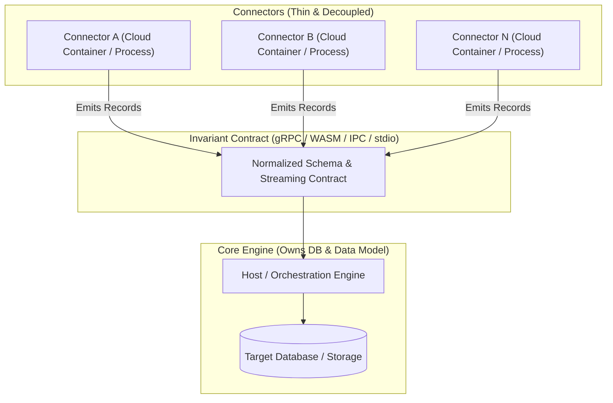

# Architecture Research: Modular Connector Ecosystem

## 1. Executive Summary & Problem Framing

### Core Requirements
* **Diverse Connectors:** Many heterogeneous connectors (REST, GraphQL, SQL, message queues, proprietary protocols, event streams).
* **Dual Deployment Target:**
  * **Desktop Mode:** Lightweight, single-process or local IPC, low resource overhead, zero complex orchestration, offline-capable.
  * **Cloud Mode:** Modular, single container per connector, independent autoscaling, isolated failure domains.
* **The "Shared Library" Paradox:**
  * Connectors need common functionality: database access, data model read/write, validation, interoperability, transformations.
  * **Critical constraint:** Preventing dependency hell and avoiding bumping/re-releasing 50+ connector packages every time the shared data layer or database schema evolves.

---

## 2. Core Architectural Observations

### The Anti-Pattern: Fat Embedded Library
If connectors statically import a library containing database clients, schema models, and business logic:
* Any database migration, driver update, or data model change requires bumping versions, rebuilding, testing, and redeploying all 50+ connectors.
* Connector code becomes coupled to storage infrastructure (SQL dialects, connection pooling, ORM versions).

### The Inversion Principle: "Smart Host, Thin Connector"
To decouple connectors from storage and data model evolutions, **connectors must not connect directly to the database**.
* The **Host/Runtime Engine** owns the database connections, migrations, storage engine, credential vaults, and central data model.
* The **Connector** is purely an adapter: it communicates with the external system, maps data into a stable protocol/schema, and emits/consumes records.



---

## 3. Connector Architectural Patterns

| Pattern | Description | Desktop Fit | Cloud Fit | Version Decoupling |
| :--- | :--- | :--- | :--- | :--- |
| **A. Inverted Out-of-Process (gRPC / Sidecar)** | Host runs storage/DB; connectors are independent processes/containers communicating over gRPC/Protobuf. | High (local socket/loopback) | Excellent (containers/pods) | **Very High** (Protobuf forward/backward compatibility) |
| **B. WASM Component Model (Extism / Wasmtime)** | Connectors are sandboxed WebAssembly bytecode files executed inside the Host process. | Outstanding (single binary, tiny RAM) | High (WASM runtimes in containers) | **Maximum** (Hot-reload, no container needed per connector) |
| **C. Standard Stream Pipes (Singer / Unix Pipe)** | Connectors are CLI executables exchanging newline-delimited JSON or Arrow records via `stdin`/`stdout`. | High (subprocesses) | High (batch/job containers) | **High** (Schema-validated JSON streams) |
| **D. Dynamic In-Process Modules (Plugins)** | Host dynamically loads shared libraries (`.so`/`.dll` or JVM ClassLoaders). | Medium | Low | **Low** (ABI breakage, memory leaks, binary coupling) |

### Recommended Pattern: Pattern A (gRPC Sidecar/Service) or Pattern B (WASM)
* **Pattern A (gRPC Contract):** Best for full language freedom and micro-containers. In Cloud, each connector runs in its own Docker container communicating via HTTP/2 or gRPC. In Desktop, the Host spawns connector binaries as local child processes over IPC/Domain Sockets or loopback TCP.
* **Pattern B (WASM Plugins):** Connectors compile to `.wasm`. In Desktop, all 50 connectors can live as tiny `.wasm` files in a folder, loaded on-demand in milliseconds inside a single host process. In Cloud, they can either run in a shared WASM runner or wrapped in minimal scratch containers.

---

## 4. Solving the "50x Version Bump" Problem

To ensure connectors never break when the core library or data model updates:

1. **Protocol Buffers / Schema Contracts with Additive Changes:**
   * Define the connector-to-host interface via Protobuf or JSON Schema.
   * New database fields or features are strictly optional/additive.
   * Connectors continue running on v1 contract while Host is at v2.
2. **Capability-Based Host Services (Inversion of Control):**
   * Instead of embedding DB drivers in connectors, the Host exposes capabilities to connectors (e.g., `SaveRecord`, `GetCursor`, `EmitEvent`).
   * Connectors never know whether the backing store is PostgreSQL, SQLite, or S3.
3. **Data Model Translation Layer:**
   * Connectors output raw or semi-normalized key-value envelopes (`id`, `timestamp`, `entity_type`, `payload_json`, `metadata`).
   * The Host engine runs transformation/ingestion pipelines to map envelopes to internal relational or document models.

---

## 5. Technology Stack Evaluation (Challenging Ktor Native)

### Critique of Kotlin / Ktor Native

| Aspect | Kotlin / Native Assessment |
| :--- | :--- |
| **Startup Time** | **Good** (< 50ms native binary startup). |
| **Container Footprint** | **Fair** (20–40 MB binary, minimal base image). |
| **Ecosystem & Connector Drivers** | **Critical Weakness:** Kotlin Native lacks direct access to the rich JVM ecosystem. Standard database drivers (JDBC, R2DBC), proprietary enterprise SDKs (Salesforce, SAP, AWS, GCP, Azure), message brokers, and niche protocol libraries are largely JVM-only and not available for Kotlin/Native. Developing custom C-interop bindings for 50 connectors is prohibitive. |
| **Build & CI Performance** | **Severe Bottleneck:** Kotlin/Native uses LLVM. Linking a single binary is resource-intensive and slow (often 1–3 minutes). Compiling 50 separate connector binaries in CI will cause massive pipeline congestion. |
| **Desktop Cross-Platform** | Multi-target compilation (macOS, Windows mingwX64, Linux x64) requires distinct platform runners or complex cross-toolchains. |

---

### Comparative Technology Matrix

| Technology | Strengths | Drawbacks | Best Role |
| :--- | :--- | :--- | :--- |
| **Go** | • Instant compilation (seconds, not minutes)<br>• Immense ecosystem of API & DB clients<br>• Zero-dependency single static binaries (`scratch` Docker images ~15MB)<br>• Low RAM (10–30MB), cold start < 10ms<br>• Trivial cross-compilation (`GOOS`/`GOARCH`) | • Lack of runtime dynamic loading (must use IPC/gRPC or WASM for plugins) | **Top Choice for Cloud Containers & Connector Microservices** |
| **Rust + WASM (Extism/Wasmtime)** | • Ultimate memory safety & zero GC pauses<br>• Compile connectors to portable `.wasm` modules<br>• True Desktop & Cloud parity (run in-process or via container)<br>• Instant execution | • Steeper learning curve for community connector authors | **Top Choice for WASM Plugin Architecture** |
| **Kotlin JVM + GraalVM Native Image** | • Full access to complete JVM connector ecosystem (JDBC, Kafka, etc.)<br>• GraalVM Native Image gives < 20ms startup & native Docker images<br>• Same Kotlin language syntax | • GraalVM reflection configuration overhead<br>• High build-time memory usage in CI | **Top Choice if staying strictly within Kotlin** |
| **Node.js / Bun / TypeScript** | • Fastest authoring speed for REST/GraphQL connectors<br>• Vast npm ecosystem<br>• Bun provides rapid startup (< 15ms) and single-executable compilation | • Higher memory usage under heavy concurrent load | **Alternative for I/O-heavy API connectors** |

---

## 6. Recommended Strategy & Roadmap

### Recommended Architecture: Host-Connector Decoupled Pipeline

```
+-----------------------------------------------------------------------------------+
|                                  DEPLOYMENT MODES                                 |
+----------------------------------------+------------------------------------------+
|              DESKTOP MODE              |                CLOUD MODE                |
|  Single Desktop App / Host Process     |  Kubernetes / Container Orchestrator     |
|                                        |                                          |
|  +----------------------------------+  |  +----------------+  +----------------+  |
|  | Host Runtime Engine (SQLite/Core)|  |  | Connector 1    |  | Connector 2    |  |
|  +-----------------+----------------+  |  | Container (Go) |  | Container (Go) |  |
|                    | IPC/Socket        |  +-------+--------+  +-------+--------+  |
|  +-----------------+----------------+  |          \                  /            |
|  | Connector Processes or WASM Mods |  |           \   gRPC / HTTP  /             |
|  | (Connector 1, Connector 2, ...)  |  |            v              v              |
|  +----------------------------------+  |  +------------------------------------+  |
|                                        |  | Ingestion & Storage Service (Host) |  |
|                                        |  +-----------------+------------------+  |
|                                        |                    | SQL / Warehouse     |
|                                        |                    v                     |
|                                        |             [( PostgreSQL )]             |
+----------------------------------------+------------------------------------------+
```

### Actionable Next Steps
1. **Define the Canonical Connector Contract (Phase 1):**
   * Specify Protobuf / gRPC schemas for connectors: `Discovery` (metadata), `ReadStream` (records emission), `WriteStream` (ingestion), `HealthCheck`.
2. **Decouple Database Logic from Connector Modules (Phase 1):**
   * Keep database drivers and data models solely inside the core Host application.
3. **Prototype Host & Connector in Go or Kotlin JVM (Phase 2):**
   * Test Go or Kotlin (GraalVM / standard JVM) for connector development to compare developer velocity, build times, and image sizes.
4. **Evaluate WebAssembly (Extism) for Desktop Plugin Density (Phase 3):**
   * Evaluate whether packaging connectors as `.wasm` files achieves the optimal balance of isolation, portability, and zero-overhead local desktop execution.
